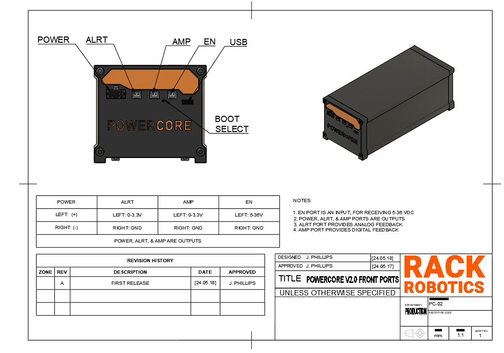

# Powercore V2.0

The Powercore V2.0 is an open-source wire EDM (electrical discharge machining) power supply developed by Rack Robotics. It aims to provide a cost-effective and easily replicable solution for wire EDM enthusiasts and professionals. The project includes detailed electrical schematics, firmware, and CAD models. This EDM power supply (spark generator) is intended to be used on custom wire EDM and plunge EDM machines. This porject is open-source, to encourage collaboration and innovation within the wire EDM community.

 

| Powercore V2.0 Specification    | Value                    |
|---------------------------------|--------------------------|
| Typical Input Power             | 200 Watts                |
| Input Voltage                   | 90-264 VAC               |
| Input Frequency                 | 47-63 Hz                 |
| Output Voltage                  | 65 VDC                   |
| Power Efficiency                | Up to 90%                |
| PSU Enable Port Voltage Input   | 5-36 V                   |
| Physical Dimensions (XYZ)       | 97 x 224 x 79.5 (mm)     |

## Features 
- Firmare optimized for stable wire EDM opperation
- Up to 180 Watts EDM Power Output (Output Port)
- Up to 18 mJ per EDM spark
- Up to 10 kHz Maximum EDM Pulse Frequency
- Dual-core RP2040 Microcontroller up to 133 MHz (USB Port)
- Real-Time Current Sensing Telemetry (AMP Port) 
- Real-Time Spark Ignition Telemetry (ALRT Port) 
- External PSU Enable Safety Feature

## FAQ
**Can this cut X material?**

EDM can errode any conductive material. The rate of EDM (Electrical Discharge Machining) machining, also known as spark erosion, is significantly influenced by the thickness, melting point, and density of the material being worked on. Thicker materials generally require more time to erode due to the increased volume that must be removed. Materials with a higher melting point also slow down the machining rate as more energy is required to melt and vaporize the material at the spark point. Additionally, denser materials resist erosion more effectively, requiring more discharge energy to achieve the same material removal rate as less dense materials. Example feedrates are provided bellow, for 0.3 mm diameter zinc-coated, hard brass wire.

| Material                        | Example Feedrate         |
|---------------------------------|--------------------------|
| 3    mm Aluminum                | 10 - 28 mm/min           |
| 19   mm Aluminum                | 1.6 - 4.4 mm/min         |
| 4.75 mm Aluminum                | 6 - 17 mm/min            | 

**Can the Powercore V2.0 be used for sinker/plunge EDM?**

Yes. Gap control is highly recommended for sinker/plunge applications. In plunge/sink EDM, gap control is critical for maintaining machining stability. The gap, or spark gap, is the small space between the electrode and the workpiece. Proper gap control ensures consistent sparking conditions, preventing short circuits and arcing that can damage the workpiece and electrode. It also aids in efficient debris removal, cooling, and flushing of the dielectric fluid, which are essential for maintaining a smooth surface finish and achieving high-accuracy machining. Without precise gap control, the machining process can become unstable, leading to poor-quality results and increased wear on the electrodes. The Powercore V2.0 has a current sense and short alert output port to assist the user in thier implementation. 

## Operation

| Port | Description |
| --- | --- |
|**POWER** | The Powercore V2.0 outputs EDM waveforms through an 8-position Molex Micro-Fit 3.0 connector. The included output cable is 1 meter long and rated for 30 cycles. This cable consists of four twisted pairs to significantly reduce electromagnetic emissions. For more information about twisted wires and their benefits, refer to the best practices section.|
|**ALRT** | The Powercore V2.0 provides digital telemetry on the spark ignition rate via the ALRT port. The spark ignition rate, defined as the ratio of 'observed discharges' to 'possible discharges'. The spark ignition rate is a key indicator of feedrate efficiency. A low rate suggests the feedrate can be increased, while a high rate indicates an excessive feedrate or a short circuit. Telemetry is reported as a PWM duty cycle, which can be read by a control board or microcontroller. This port enables closed-loop feedrate control, ensuring optimal material removal. An ignition rate of approximately 80% has been observed to be optimal.|
|**AMP**| The Powercore V2.0 provides analog telemetry via the on-board current sensor (U17A, LMV358AIDGKR, output shunt). It is mapped to between 0V and 3.3V, at a rate of 12 mV/A. This may be used for closed-loop feedback control and debugging. |
|**EN**| The Powercore V2.0 features an "enable port" that ensures safety by requiring activation before the device outputs EDM waveforms. When the Powercore is plugged in, it remains inactive until the enable port receives a DC voltage between **5V and 36V**. This port draws minimal current. The enable port can be connected to GPIO, motor, heater, or LED ports on a 3D printer or CNC control board, or controlled manually with a switch. *To prevent damage*, avoid disconnecting the main AC power while the enable port is active.|
|**USB**| A type-C USB port provides communication with the on-board RP2040 micronctroller and flash memory. Pressing the reset button (the pin-hole located between the ‘AMP’ and ‘EN’ ports) during power-up initiates the USB bootloader mode, allowing access to the flash memory. When the reset button is held down while powering up, the RP2040 enters a special state where it presents itself as a mass storage device to a connected computer. This enables users to drag and drop firmware files directly into the flash memory, facilitating easy updates and modifications without needing additional programming tools or interfaces.|

**Best_Practices**

- Avoid short circuits. A short circuit occurs when the POWER port outputs short together. This may happen if wiring is incorrect, or the cutting electrode collides with the work. A prolonged short circuit can damage the Powercore.
- Twist the output power cable pairs together. Twisting the positive and negative output conductors together dramatically reduces EMI, and improves the cutting efficiency of the device. Output cables come twisted from Rack Robotics.
- When integrating the Powercore V2.0 into a wire EDM build, ensure that the EN port fails to an off default state during machine shutoff.
  
⚠ Avoid touching the electrodes and workpiece during operation to prevent exposure to high-voltage DC (65V). Additionally, individuals with pacemakers or similar medical devices should not operate the Powercore, as the high-voltage environment could interfere with their functionality. 

# Hardware Overview

The Powercore V2.0 contains a custom SMPS and motherboard. The internal SMPS is rated for 300 W typical and 550 watts peak, and accepts a range of AC voltages and frequencies. The SMPS provides 72 VDC to the motherboard, via the motherboard input supply connector (J1). The motherboard converts the steady 72 VDC input power, into pulsed high-current DC power, which is suitable for EDM.

**Theory of Operation**

The Powercore V2.0 motherboard delivers parametric pulsed DC through the repeated charging and discharging of a 32.9 µF capacitor bank. Efficient and rapid capacitor charging is achieved via a [peak current-mode control](https://www.ti.com/lit/ab/sboa187e/sboa187e.pdf?ts=1716007342402&ref_url=http%253A%252F%252Fwww.ti.com.cn%252Fproduct%252Fcn%252Flmp8481%253FDCMP%253DRTM%2526%253D20130429) (PCMC) *charger stage*. The onboard RP2040 *microcontroller* monitors the capacitor voltage and adjusts the PCMC charger parameters accordingly. When an output pulse is needed, the RP2040 discharges the capacitor bank through the MOSFET-driven *output stage* into the POWER port. This design allows for precise control over the EDM output pulse parameters: on-time, off-time, and peak voltage.

⚠ Adjustment of the firmware, including the on-time, off-time, and peak-voltage, may lead to damage of the PCMC switching converter. Do so at your own risk. 

**Motherboard**

- RP2040 Microcontroller with 16Mbit of FLASH Memory
- EMI Filter
- 72 VDC to 12 VDC Buck Converter
- 12 VDC & 5 VDC LDO
- Peak Current Detector
- Limit PWM Filter
- V_SENSE Scaler + Filter
- Peak Capacitor Voltage Trigger
- Constant Current PWM Generator
- Constant Current Limit Compensator & Slope Generator
- Output Curretn Sensor
- Charger Power Stage
- Output Stage

## Firmware Overview

## 6. Legal & License
